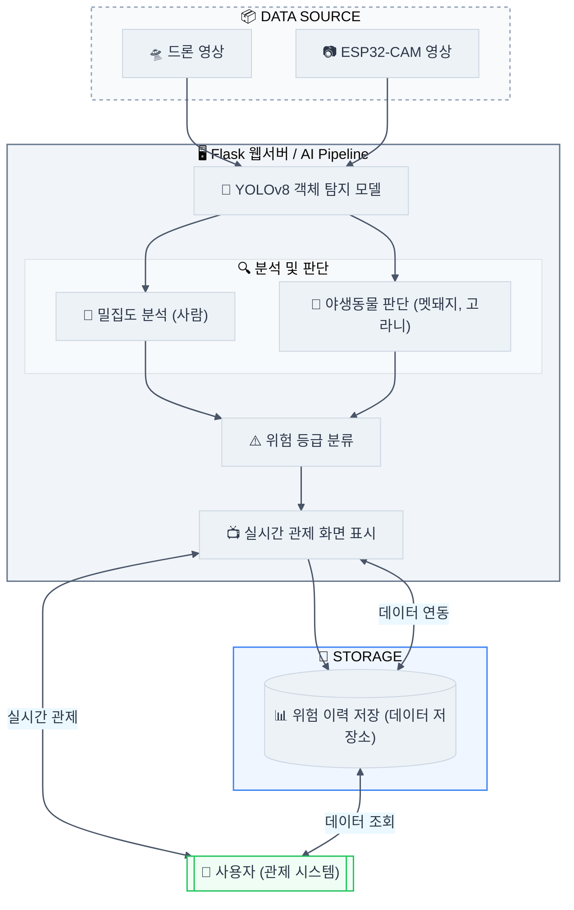

# DSM 시스템 구조도

```mermaid
%%{init: {
  'theme': 'base',
  'themeVariables': {
    'primaryColor': '#EDF2F7',
    'primaryTextColor': '#2D3748',
    'primaryBorderColor': '#CBD5E0',
    'lineColor': '#4A5568',
    'secondaryColor': '#EBF8FF',
    'tertiaryColor': '#F7FAFC'
  }
}}%%
graph TD

%% 데이터 소스 영역
subgraph S1["📦 DATA SOURCE"]
    A1["🛸 드론 영상"]
    A2["📷 ESP32-CAM 영상"]
end

%% AI 및 분석 서버 영역
subgraph S2["🖥️ Flask 웹서버 / AI Pipeline"]
    B["🧠 YOLOv8 객체 탐지 모델"]
    
    subgraph S2_1["🔍 분석 및 판단"]
        c1["👥 밀집도 분석 (사람)"]
        c2["🐗 야생동물 판단 (멧돼지, 고라니)"]
    end
    
    D["⚠️ 위험 등급 분류"]
    E["📺 실시간 관제 화면 표시"]
end

%% 저장소 영역
subgraph S3["💾 STORAGE"]
    F1[("📊 위험 이력 저장 (데이터 저장소)")]
end

%% 사용자 영역
G[["👤 사용자 (관제 시스템)"]]

%% --- 스타일 지정 ---
style S1 fill:#F8FAFC,stroke:#94A3B8,stroke-width:1.5px,stroke-dasharray: 4 4
style S2 fill:#F1F5F9,stroke:#64748B,stroke-width:1.5px
style S3 fill:#EFF6FF,stroke:#3B82F6,stroke-width:1.5px
style G fill:#F0FDF4,stroke:#22C55E,stroke-width:1.5px

%% --- 데이터 흐름 고정 및 연결 (선 꼬임 방지) ---
A1 --> B
A2 --> B

B --> c1
B --> c2

c1 --> D
c2 --> D
D --> E

E --> F1

%% 사용자 및 연동 흐름을 우측 배치 유도
E <-->|실시간 관제| G
F1 <-->|데이터 조회| G
F1 <-->|데이터 연동| E

%% 화살표 스타일
linkStyle default stroke:#4A5568,stroke-width:1.5px;
```
