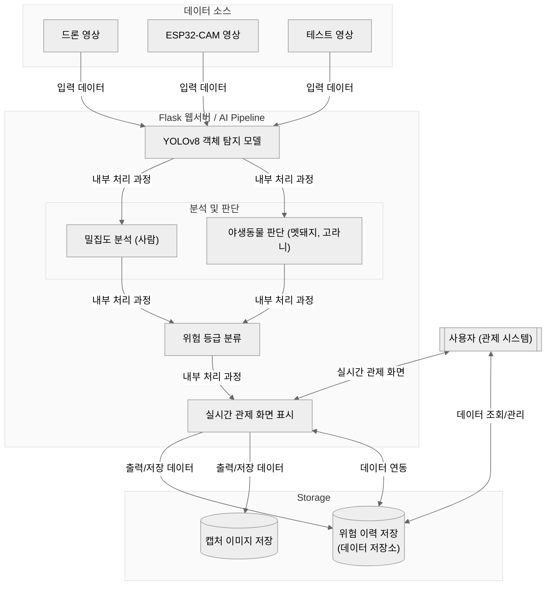

# DSM 시스템 구조도

```mermaid
%%{init: {'theme': 'neutral', 'themeVariables': { 'primaryColor': '#F4F5F7', 'edgeLabelBackground':'#ffffff', 'clusterBkg':'#FAFAFA', 'clusterBorder':'#E0E0E0'}}}%%
graph TB

%% 데이터 소스 영역
subgraph S1["데이터 소스"]
    A1["드론 영상"]
    A2["ESP32-CAM 영상"]
    A3["테스트 영상"]
end

%% AI 및 분석 서버 영역
subgraph S2["Flask 웹서버 / AI Pipeline"]
    B["YOLOv8 객체 탐지 모델"]
    
    subgraph S2_1["분석 및 판단"]
        c1["밀집도 분석 (사람)"]
        c2["야생동물 판단 (멧돼지, 고라니)"]
    end
    
    D["위험 등급 분류"]
    E["실시간 관제 화면 표시"]
end

%% 저장소 영역
subgraph S3["Storage"]
    F1[("위험 이력 저장<br>(데이터 저장소)")]
    F2[("캡처 이미지 저장")]
end

%% 사용자 영역
G[["사용자 (관제 시스템)"]]

%% --- 데이터 흐름 및 연결 관계 ---

%% 1. 데이터 입력
A1 -->|입력 데이터| B
A2 -->|입력 데이터| B
A3 -->|입력 데이터| B

%% 2. 모델 내부 처리
B -->|내부 처리 과정| c1
B -->|내부 처리 과정| c2
c1 -->|내부 처리 과정| D
c2 -->|내부 처리 과정| D
D -->|내부 처리 과정| E

%% 3. 출력 및 저장
E -->|출력/저장 데이터| F1
E -->|출력/저장 데이터| F2

%% 4. 관제 및 상호작용
G <-->|실시간 관제 화면| E
G <-->|데이터 조회/관리| F1
F1 <-->|데이터 연동| E
```
