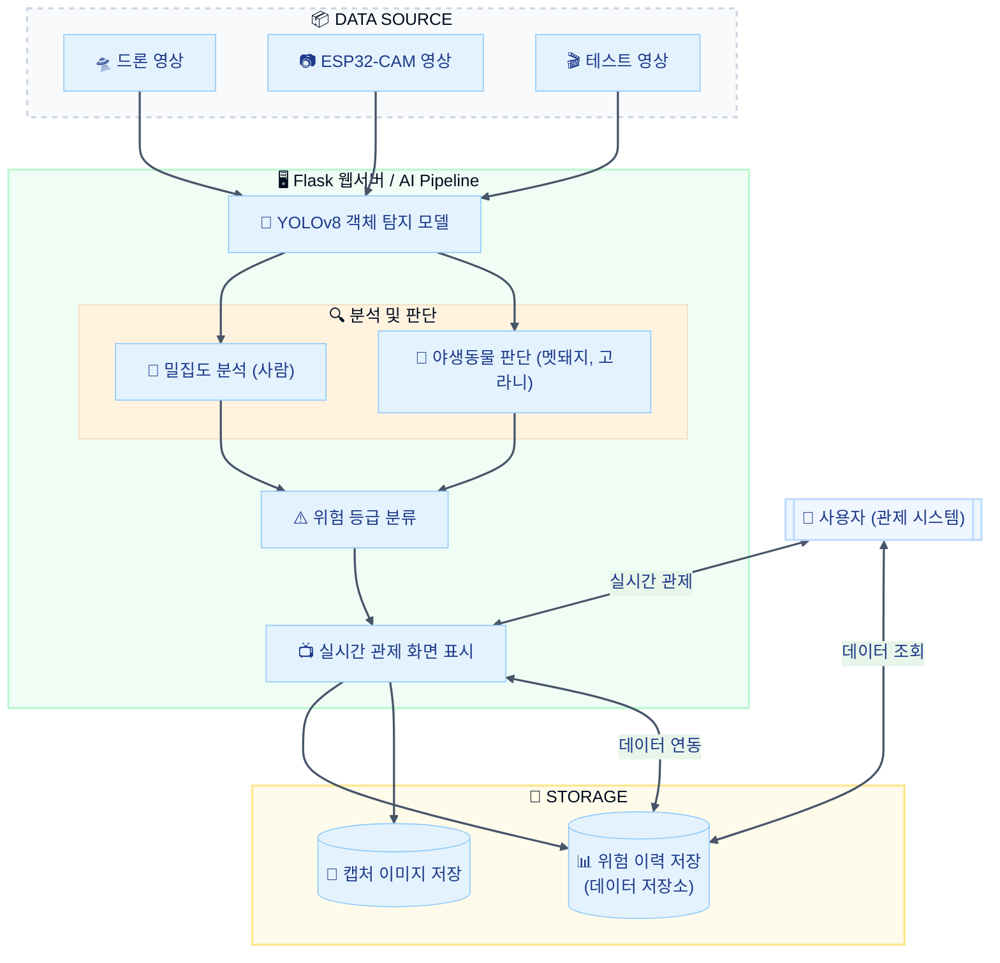

# DSM 시스템 구조도

```mermaid
%%{init: {
  'theme': 'base',
  'themeVariables': {
    'primaryColor': '#E3F2FD',
    'primaryTextColor': '#1E3A8A',
    'primaryBorderColor': '#90CAF9',
    'lineColor': '#475569',
    'secondaryColor': '#E8F5E9',
    'tertiaryColor': '#FFF3E0'
  }
}}%%
graph TB

%% 데이터 소스 영역
subgraph S1["📦 DATA SOURCE"]
    A1["🛸 드론 영상"]
    A2["📷 ESP32-CAM 영상"]
    A3["🎬 테스트 영상"]
end

%% AI 및 분석 서버 영역
subgraph S2["🖥️ Flask 웹서버 / AI Pipeline"]
    B["🧠 YOLOv8 객체 탐지 모델"]
    
    subgraph S2_1["🔍 분석 및 판단"]
        c1["👥 밀집도 분석 (사람)"]
        c2["🐗 야생동물 판단 (멧돼지, 고라니)"]
    end
    
    D["⚠️ 위험 등급 분류"]
    E["📺 실시간 관제 화면 표시"]
end

%% 저장소 영역
subgraph S3["💾 STORAGE"]
    F1[("📊 위험 이력 저장<br>(데이터 저장소)")]
    F2[("📸 캡처 이미지 저장")]
end

%% 사용자 영역
G[["👤 사용자 (관제 시스템)"]]

%% --- 스타일 지정 ---
style S1 fill:#F8FAFC,stroke:#CBD5E1,stroke-width:2px,stroke-dasharray: 5 5
style S2 fill:#F0FDF4,stroke:#BBF7D0,stroke-width:2px
style S3 fill:#FFFBEB,stroke:#FDE68A,stroke-width:2px
style G fill:#EFF6FF,stroke:#BFDBFE,stroke-width:2px

%% --- 데이터 흐름 및 연결 관계 ---
A1 --> B
A2 --> B
A3 --> B

B ==> c1
B ==> c2
c1 ==> D
c2 ==> D
D ==> E

E --> F1
E --> F2

G <-->|실시간 관제| E
G <-->|데이터 조회| F1
F1 <-->|데이터 연동| E

%% 화살표 스타일
linkStyle default stroke:#475569,stroke-width:2px;
```

